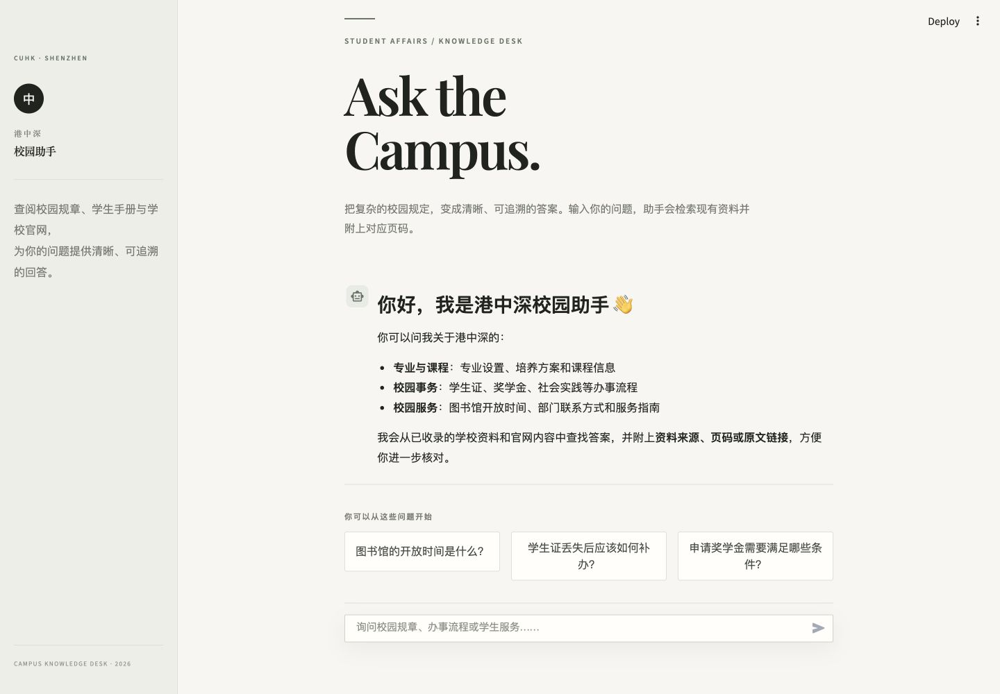
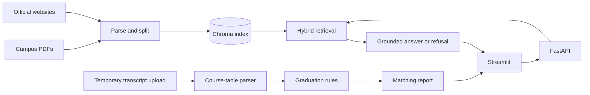

# Campus Knowledge Assistant

A RAG project for university regulations, student handbooks, study schemes, and official university websites. It retrieves evidence from indexed sources, generates answers with page numbers or source links, and explicitly refuses when evidence is insufficient.

The project also provides transcript parsing and graduation-requirement matching for CUHK-Shenzhen undergraduate students. Users can temporarily upload an electronic transcript, confirm their programme and admission year, and review completed, in-progress, and missing courses. Transcripts are never added to the knowledge base.

## Interface



## Features

### Campus knowledge Q&A

- Recursively ingest campus PDFs while preserving document and page metadata
- Incrementally collect public content from allowlisted university websites
- Build a persistent Chroma vector index and skip unchanged documents
- Combine vector and keyword retrieval, with optional reranking
- Support Chinese and English questions and common cross-language campus terms
- Generate evidence-grounded answers with source citations
- Refuse low-confidence questions instead of guessing
- Provide FastAPI endpoints and a Streamlit chat interface

### Transcript and graduation-requirement matching

- Upload, parse, and confirm transcript information in a dedicated dialog
- Parse course codes, names, credits, grades, and terms from CUHK-Shenzhen electronic transcripts
- Distinguish passed, in-progress, failed, and withdrawn courses
- Support grade markers such as `PA`, `DI`, and `IP`
- Filter page numbers, dates, Dean's List entries, academic-year labels, and other non-course text
- Merge course names that wrap across lines
- Summarize completed courses, courses in progress, and recognized credits
- Match requirements by programme and admission year
- Map English programme names to canonical names in the ruleset
- Process transcripts temporarily without adding them to the RAG index

The current ruleset covers Computer Science and Technology for the 2023 admission year. Additional programmes and years require additional rules.

## Architecture



Knowledge Q&A and transcript analysis are separate flows. Transcript data is not written to Chroma and cannot become evidence for later questions.

## Repository structure

The main application modules are:

- `app/api.py`: FastAPI endpoints
- `app/ui.py`: Streamlit interface
- `app/documents.py`: campus PDF parsing and splitting
- `app/transcript.py`: transcript parsing and requirement checks
- `app/retrieval.py`: hybrid retrieval, filtering, and deduplication
- `app/generation.py`: grounded answers and citations
- `app/index.py`: incremental PDF indexing
- `app/web_documents.py` and `app/web_index.py`: website extraction and indexing
- `app/ingest.py` and `app/ingest_web.py`: indexing commands
- `app/evaluate.py`: offline evaluation
- `data/`: graduation rules, study schemes, and website allowlist
- `tests/`: automated tests
- `vector_db_dir/`: local vector index

## Tech stack

- Python 3.10+
- FastAPI, Pydantic, and Uvicorn
- Streamlit
- LangChain, Chroma, and Sentence Transformers
- OpenAI-compatible Chat API
- pypdf and Beautiful Soup
- pytest and Ruff

## Quick start

### Install dependencies

```bash
python3 -m venv .venv
source .venv/bin/activate
pip install -r requirements.txt
cp .env.example .env
```

Configure the model service in `.env`. At minimum, set `LLM_API_KEY` and verify `LLM_PROVIDER`, `LLM_BASE_URL`, and `LLM_MODEL_ID`. Never commit real API keys.

### Build the campus knowledge index

Place PDFs in `data/` or one of its subdirectories, then run:

```bash
python -m app.ingest
```

To use another source directory:

```bash
python -m app.ingest --source /path/to/campus-pdfs
```

To download CUHK-Shenzhen study schemes for a specific admission year:

```bash
python -m app.crawl_study_schemes --year 2023
python -m app.ingest
```

### Optional: ingest official websites

Configure `data/web_sources.json` with an entry URL, allowed domains, and allowed paths, then run:

```bash
python -m app.ingest_web
```

The crawler stays within the allowlisted scope and skips unchanged pages.

### Start the services

Use two terminals with the virtual environment activated:

```bash
uvicorn app.api:app --reload
```

```bash
source .venv/bin/activate
streamlit run app/ui.pystreamlit run app/ui.py
```

The default frontend is `http://localhost:8501`; API documentation is at `http://127.0.0.1:8000/docs`. Set `API_URL` to point the frontend to another API address.

## Using transcript matching

1. Click **Upload and parse transcript** in the sidebar.
2. Select a PDF up to 10 MB.
3. Confirm the detected programme, admission year, course count, and credits.
4. Expand the course details and check terms, grades, and statuses.
5. Click **Generate matching report**.

The parser currently targets CUHK-Shenzhen electronic transcripts with a table header like:

```text
Course Code | Course Title | Units | Grade | % of A- and above
```

Privacy safeguards:

- Uploaded files are processed through temporary files and removed afterward.
- Transcripts are not added to the campus knowledge base.
- Test fixtures contain no real names, student IDs, or identity-document numbers.
- Reports are for course-planning reference only; the Registry's final review prevails.

## Configuration

See `.env.example` for all environment variables. Common settings include the model provider and endpoint, data and index directories, embedding model, retrieval thresholds, optional reranking, and the frontend API address.

Rebuild the index after changing the embedding model or text-splitting parameters.

## Tests and evaluation

```bash
pip install -r requirements-dev.txt
pytest
ruff check .
python -m app.evaluate
```

Unit tests use fakes and mocks, so paid model keys are not required. Offline evaluation covers retrieval hits, cited pages, refusal behavior, and response time. It is intended for regression testing and does not replace evaluation on real institutional data.

## Current limitations

- OCR is not included; scanned PDFs must first be converted into searchable PDFs.
- Transcript parsing currently targets CUHK-Shenzhen electronic transcripts; other institutions need separate adapters.
- Graduation rules currently cover only Computer Science and Technology for the 2023 admission year.
- Exchange credits, exemptions, university-core requirements, and specialization requirements may still require manual review.
- Website ingestion does not execute JavaScript, so dynamically rendered pages may not yield usable text.
- Removing a PDF from the data directory does not automatically remove its old vectors.
- Chat history is not persisted across sessions.
- Model wording may still be imperfect; verify answers against the cited source documents.

## Roadmap

- Add graduation rules for more programmes and admission years
- Add independent transcript adapters for other institutions
- Add OCR and layout-aware parsing
- Add index deletion synchronization and an administrator import-status page
- Tune retrieval against larger, representative evaluation sets

## Acknowledgements and license

Thanks to [`DeepShah1406/College_RAG_Chatbot`](https://github.com/DeepShah1406/College_RAG_Chatbot) for the original implementation ideas. This project follows the repository's MIT License; see [LICENSE](LICENSE).
