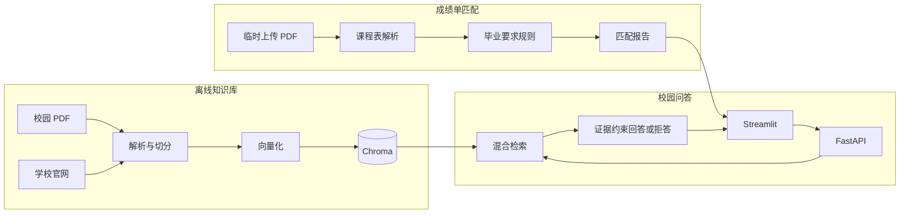

# 校园知识问答助手

面向高校规章、学生手册、培养方案和学校官网的 RAG（检索增强生成）项目。系统从已收录资料中检索证据，生成带页码或官网链接的回答；资料不足时明确拒答，避免依赖模型自身知识猜测。

项目还提供港中深本科生成绩单解析与毕业要求匹配功能：用户可临时上传电子成绩单，确认专业和入学年份，并查看已完成、在修和缺失课程。成绩单不会加入知识库。

本项目由开源项目 `DeepShah1406/College_RAG_Chatbot` 重构而来，重点是清晰、可测试、可评测的端到端 RAG 工程。

## 界面


## 主要功能

### 校园知识问答

- 批量导入校园 PDF，并保留文档名称和页码
- 从白名单学校官网增量采集公开内容
- Chroma 持久化向量索引，文档未变化时跳过重复处理
- 向量与关键词混合检索，可选 reranker
- 中英文提问、常见校园术语跨语言检索
- 基于检索证据生成回答并展示引用
- 低相关度时拒答，不调用模型猜测
- FastAPI 接口与 Streamlit 对话界面

### 成绩单与毕业要求匹配

- 在独立弹窗中上传、解析和确认成绩单信息
- 解析港中深电子成绩单中的课程代码、名称、学分、成绩和学期
- 区分已完成、在修、失败和退课状态
- 支持 `PA`、`DI`、`IP` 等港中深成绩标记
- 过滤页码、日期、Dean's List、Academic Year 等非课程内容
- 支持跨行课程名称
- 统计已完成课程、在修课程和已识别学分
- 按专业及入学年份匹配毕业要求
- 支持英文专业名称映射到规则库标准名称
- 文件仅用于当前服务进程中的临时分析，不会进入 RAG 索引

当前规则库包含“计算机科学与技术”专业、2023 年入学版本。其他专业和年份需要补充对应规则。

## 系统架构



知识问答和成绩单分析相互独立：成绩单不会写入 Chroma，也不会成为后续问答的检索材料。

## 代码结构

```text
app/
├── api.py                   # FastAPI 接口
├── ui.py                    # Streamlit 界面
├── config.py                # 环境变量与配置
├── documents.py             # 校园 PDF 解析与切分
├── transcript.py            # 成绩单解析与毕业要求检查
├── retrieval.py             # 混合检索、过滤与去重
├── generation.py            # 证据约束回答与引用
├── service.py               # 问答流程编排
├── index.py                 # PDF 增量索引
├── web_documents.py         # 官网内容提取
├── web_index.py             # 官网增量索引
├── ingest.py                # PDF 索引命令
├── ingest_web.py            # 官网采集命令
└── evaluate.py              # 离线评测
data/
├── graduation_requirements.json  # 毕业要求规则
├── study_schemes/                # 培养方案及清单
└── web_sources.json              # 官网白名单配置
evaluation/                        # 离线评测数据
tests/                             # 自动化测试
vector_db_dir/                     # 本地向量索引
```

## 技术栈

- Python 3.10+
- FastAPI、Pydantic、Uvicorn
- Streamlit
- LangChain、Chroma、Sentence Transformers
- OpenAI-compatible Chat API
- pypdf、Beautiful Soup
- pytest、Ruff

## 快速开始

### 1. 安装依赖

```bash
python3 -m venv .venv
source .venv/bin/activate
pip install -r requirements.txt
cp .env.example .env
```

在 `.env` 中配置模型服务。至少需要设置 `LLM_API_KEY`，并根据供应商确认 `LLM_PROVIDER`、`LLM_BASE_URL` 和 `LLM_MODEL_ID`。

不要把真实密钥提交到仓库。

### 2. 构建校园资料索引

把 PDF 放入 `data/` 或其子目录，然后执行：

```bash
python -m app.ingest
```

也可以指定其他资料目录：

```bash
python -m app.ingest --source /path/to/campus-pdfs
```

如需下载指定入学年份的港中深主修修读计划：

```bash
python -m app.crawl_study_schemes --year 2023
python -m app.ingest
```

### 3. 可选：采集学校官网

编辑 `data/web_sources.json`，为每个来源设置入口 URL、允许域名和允许路径，然后执行：

```bash
python -m app.ingest_web
```

采集器只访问白名单范围，并对未变化页面执行增量跳过。

### 4. 启动服务

打开两个终端并激活虚拟环境。

终端一：

```bash
uvicorn app.api:app --reload
```

终端二：

```bash
streamlit run app/ui.py
```

默认地址：

- 前端：`http://localhost:8501`
- API 文档：`http://127.0.0.1:8000/docs`

可通过 `API_URL` 修改前端连接的 API 地址。

## 使用成绩单匹配

1. 在左侧栏点击“上传并解析成绩单”。
2. 选择 10 MB 以内的 PDF。
3. 确认识别到的专业、入学年份、课程数量和学分。
4. 展开课程明细，检查学期、成绩及状态。
5. 点击“生成匹配报告”。

当前解析器针对具有以下表头的港中深电子成绩单：

```text
Course Code | Course Title | Units | Grade | % of A- and above
```

为保护隐私：

- 上传文件使用临时文件处理，完成后删除
- 成绩单不会加入校园知识库
- 测试夹具不包含真实姓名、学号或证件信息
- 报告仅供选课规划参考，以教务处最终审核为准

## 配置

所有环境变量示例见 `.env.example`。常用配置包括：

- 模型供应商、接口地址、模型名称和 API Key
- 数据目录和索引目录
- Embedding 模型
- 检索数量、相关度阈值和可选 reranker
- 前端访问的 API 地址

修改 Embedding 模型或文本切分参数后，应重新构建索引。

## 测试与评测

```bash
pip install -r requirements-dev.txt
pytest
ruff check .
python -m app.evaluate
```

单元测试使用 fake/mock，不需要付费模型 Key。离线评测覆盖检索命中、引用页码、拒答和响应时间；它用于开发回归，不替代真实资料上的人工评估。

## 当前限制

- 成绩单暂不支持 OCR；扫描版 PDF 需要先转换为带文字层的可搜索 PDF
- 当前成绩单表格解析针对港中深电子成绩单，其他学校格式需要独立适配
- 当前毕业要求规则只覆盖计算机科学与技术专业 2023 年入学版本
- 交换、豁免、大学核心课程和方向要求中部分项目仍需人工核验
- 官网采集不执行 JavaScript，动态渲染页面可能无法提取正文
- 从数据目录删除 PDF 后，旧向量不会自动清理
- 聊天历史不跨会话保存
- 模型回答仍可能存在措辞偏差，应以引用的原始资料为准

## 后续方向

- 增加更多专业和入学年份的毕业要求规则
- 为其他学校成绩单增加独立解析模板
- 接入 OCR 和版面感知解析
- 增加索引删除同步与管理员导入状态页面
- 使用更完整的真实评测集持续调优检索

## 致谢与许可证

感谢原始开源项目 [`DeepShah1406/College_RAG_Chatbot`](https://github.com/DeepShah1406/College_RAG_Chatbot) 提供基础实现思路。本项目沿用仓库中的 MIT License，详见 [LICENSE](LICENSE)。
