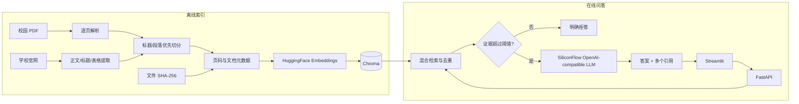

# 校园知识问答助手

一个面向高校规章、学生手册、办事指南和学校官网的 RAG（检索增强生成）项目。系统批量导入 PDF，并从白名单中的学校官网提取正文和公开联系方式；在回答校园事实前检索原始资料，展示文档页码或官网原文链接。证据不足时明确拒答，避免依赖模型自身知识猜测。

本项目由开源项目 `DeepShah1406/College_RAG_Chatbot` 重构而来，重点展示一个职责清晰、可测试、可评测的端到端 RAG 工程，而非堆叠多 Agent 或复杂工作流。

## 前端界面


## 功能

- 批量递归导入 PDF，逐页保留来源元数据
- 白名单官网增量采集，遵守 `robots.txt`、域名/路径边界及访问间隔
- 按网页标题层级保留正文、列表和表格，并自动识别邮箱、电话、办公时间与地点
- 基于文件 SHA-256 的增量索引，未变化文档不会重复入库
- 段落优先、兼顾标题与正文的文本切分
- Chroma 持久化向量索引，索引构建与问答服务解耦
- 多语言 HuggingFace Embeddings
- 中英文问题自动适配、常见校园术语跨语言检索与双语部门名称
- 向量相关度与轻量关键词相关度融合、结果去重和阈值过滤
- 硅基流动 OpenAI-compatible 模型生成受证据约束的回答，并保留 NVIDIA/Groq 兼容分支
- 文档名、页码、短证据片段及多个引用
- 低相关度自动拒答，不调用模型猜测答案
- FastAPI 结构化接口与 Streamlit 对话界面
- 单元测试和无需付费模型的离线评测脚本
- 环境变量配置、领域异常和 JSON 结构化日志

当前只实现校园知识问答，不包含课程表、活动推荐、预约、报修或多 Agent。

## 系统架构



RAG 数据流：`导入文档 → 解析页面 → 切分并记录元数据 → 建立持久索引 → 用户提问 → 检索/去重/阈值过滤 → 证据约束生成或拒答 → 返回引用`。

## 代码结构

```text
app/
├── config.py          # 环境变量与参数校验
├── documents.py       # PDF 解析、规范化和文本切分
├── web_documents.py   # 官网白名单采集、正文/字段提取与章节切分
├── web_index.py       # 官网页面哈希与增量向量索引
├── index.py           # Chroma 增量索引与 manifest
├── retrieval.py       # 向量/关键词融合、过滤与去重
├── generation.py      # 证据约束 Prompt、拒答与引用
├── service.py         # 问答用例编排
├── models.py          # 内部模型与 API Schema
├── api.py             # FastAPI
├── ui.py              # Streamlit
├── ingest.py          # 索引构建 CLI
├── ingest_web.py      # 官网采集与索引 CLI
└── evaluate.py        # 离线评测 CLI
evaluation/            # 小型评测集与示例语料
tests/                 # 核心模块单元测试
data/                  # 用户放置 PDF 的目录
vector_db_dir/         # 本地索引（默认不提交）
```

## 技术栈

- Python 3.10+
- FastAPI、Pydantic、Uvicorn
- Streamlit
- LangChain integrations、Chroma
- HuggingFace Sentence Transformers
- 硅基流动 OpenAI-compatible Chat API（兼容可选 NVIDIA/Groq 配置）
- pypdf
- Beautiful Soup
- pytest、Ruff

## 本地运行

### 1. 安装

```bash
python3 -m venv .venv
source .venv/bin/activate
pip install -r requirements.txt
cp .env.example .env
```

在 `.env` 中填入自己的 `LLM_API_KEY`，并配置 `LLM_PROVIDER`、`LLM_BASE_URL` 和 `LLM_MODEL_ID`。默认示例使用硅基流动中国站的 OpenAI-compatible endpoint `https://api.siliconflow.cn/v1`；国际站账号应改用对应的 `.com` 地址。`.env` 已被忽略；不要把真实密钥提交、打印或写进源代码。首次建立索引时，HuggingFace 模型会从网络下载并缓存。

### 2. 添加资料并构建索引

把一个或多个 PDF 放进 `data/`（支持子目录），然后执行：

```bash
python -m app.ingest
```

也可以指定其他目录：

```bash
python -m app.ingest --source /path/to/campus-pdfs
```

也可以从香港中文大学（深圳）教务处本科生手册批量下载适用于 2023 年入学学生的主修修读计划：

```bash
python -m app.crawl_study_schemes --year 2023
python -m app.ingest
```

下载结果默认保存至 `data/study_schemes/2023/`，并生成 `manifest.json`。程序会识别“2023至24年度”及
“2023至24年度及以后”等覆盖关系；没有适用版本的专业只记录在清单中。运行
`python -m app.crawl_study_schemes --year 2023 --dry-run` 可只检查选择结果而不下载 PDF。

命令会报告新增/更新、未变化跳过、失败文档、文本块数和页面提示。文件发生变化后再次运行即可增量更新。索引位于 `INDEX_DIR`，问答应用本身不会重新解析所有 PDF。

### 3. 采集学校官网并构建索引

官网来源配置位于 `data/web_sources.json`。每个来源必须明确提供入口 URL、允许域名和允许路径，避免采集器离开学校官网或抓取无关栏目：

```json
{
  "name": "学生事务处",
  "department": "学生事务处",
  "start_urls": ["https://osa.cuhk.edu.cn/zh-hans/basic/344"],
  "allowed_domains": ["osa.cuhk.edu.cn"],
  "allowed_paths": ["/zh-hans/basic/"],
  "max_pages": 20,
  "max_depth": 1,
  "delay": 0.5
}
```

执行增量采集和向量化：

```bash
python -m app.ingest_web
```

网页正文按照 `h1` 至 `h4` 标题层级切分，列表和表格转换为可检索文本；邮箱、电话、办公时间、办公地点会自动识别并附加到相关证据，但不会替代官网原文。每个文本块保留页面标题、章节、所属单位、URL、采集时间和正文哈希。正文未变化的页面不会重复向量化。网页引用不伪造页码，前端会显示章节和“查看学校官网原文”按钮。

### 4. 启动 API 和界面

使用两个终端：

```bash
source .venv/bin/activate
uvicorn app.api:app --reload
```

```bash
source .venv/bin/activate
streamlit run app/ui.py
```

API 文档默认位于 `http://127.0.0.1:8000/docs`，界面默认位于 `http://localhost:8501`。可通过 `API_URL` 改变前端访问的 API 地址。

## API 示例

```bash
curl -X POST http://127.0.0.1:8000/chat \
  -H 'Content-Type: application/json' \
  -d '{"question":"学生证丢失后如何补办？"}'
```

```json
{
  "answer": "请向学生事务中心提交补办申请。【学生手册.pdf，第 12 页】",
  "sources": [
    {
      "document": "学生手册.pdf",
        "page": 12,
        "excerpt": "学生证丢失后，应当向学生事务中心提交补办申请……",
        "score": 0.82,
        "source_type": "pdf"
    }
  ],
  "grounded": true
}
```

当没有证据超过相关度阈值时，`grounded` 为 `false`、`sources` 为空，并返回：

> 根据当前校园资料无法确定这个问题，请联系相关部门或补充资料。

## 配置

所有运行参数见 `.env.example`。常用参数包括 `EMBEDDING_MODEL`、`LLM_MODEL`、`DISTANCE_METRIC`、`CHUNK_SIZE`、`CHUNK_OVERLAP`、`TOP_K`、`FETCH_K`、`SIMILARITY_THRESHOLD`、`KEYWORD_BONUS_WEIGHT` 和 `HYBRID_SEARCH`。默认阈值为 `0.40`；向量相关度是基础分，关键词命中只作为加分项，避免词面不一致时反向压低向量结果。查询会先统一为简体中文进行词面匹配，并为已配置的校园领域概念补充简体、繁体和英文别名。对于“有哪些专业”“列出全部课程”等汇总型问题，系统会自动使用 `AGGREGATE_FETCH_K` 和 `AGGREGATE_TOP_K` 扩大召回，并通过 `AGGREGATE_MAX_CHUNKS_PER_DOCUMENT` 限制单份资料占用的证据数，优先覆盖不同文档；普通事实问题仍使用原来的 `FETCH_K` 和 `TOP_K`。默认使用归一化 embedding 与 cosine 距离；修改 embedding 模型、距离类型或切分参数后，应使用新的空 `INDEX_DIR` 重新构建索引，以免混用不兼容向量。索引 manifest 会记录这些配置，并在模型或切分配置变化时重新处理文档。

## 测试与评测

安装开发依赖并执行：

```bash
pip install -r requirements-dev.txt
pytest
ruff check .
python -m app.evaluate
```

单元测试中的模型和服务调用使用 fake/mock，不需要硅基流动、NVIDIA 或 Groq Key。离线评测使用 `evaluation/dataset.jsonl` 与 `evaluation/sample_corpus.json`，输出：

- 检索命中率
- 引用正确率
- 拒答准确率
- 平均响应时间

这是确定性的轻量离线冒烟评测，不代表真实校园语料上的生产指标。替换评测集和语料后可继续使用同一脚本；在线端到端质量还应在真实资料、真实 embedding 和目标 LLM 上单独评估。

## 当前限制

- 扫描版 PDF 尚未集成 OCR；系统会提示页面无文本，需要预先 OCR。
- PDF 表格和复杂多栏排版依赖 `pypdf` 的提取效果。
- 官网采集当前处理服务端直接返回的 HTML；必须执行 JavaScript 才能出现正文的页面会被报告为正文过短，尚未启用浏览器渲染回退。
- 官网页面删除后的旧向量尚未自动清理；更新页面可通过正文哈希正常替换。
- 关键词检索是轻量 token-overlap，与向量结果融合，并非完整 BM25 索引；中英同义词表以实际评测失败为依据维护，目前并非通用翻译词典。
- 当前不保存跨会话聊天历史；每个问题独立检索，减少历史内容污染证据。
- 模型输出仍可能出现措辞偏差；来源卡片用于人工核对，不应替代原始规章。
- 索引删除检测尚未实现：从数据目录移除 PDF 不会自动清理其旧向量。

## 后续规划

1. 接入 OCR 和版面感知解析，提高扫描件、表格和多栏 PDF 的质量。
2. 使用 BM25 + 向量检索与可选 reranker，结合真实评测集调参。
3. 增加文档删除同步、索引版本信息及管理员导入状态页面。

以上均为规划，当前版本尚未实现。

## 致谢与许可证

感谢原始开源项目 [`DeepShah1406/College_RAG_Chatbot`](https://github.com/DeepShah1406/College_RAG_Chatbot) 提供基础实现思路。本重构项目沿用仓库中的 MIT License，详见 [LICENSE](LICENSE)。
